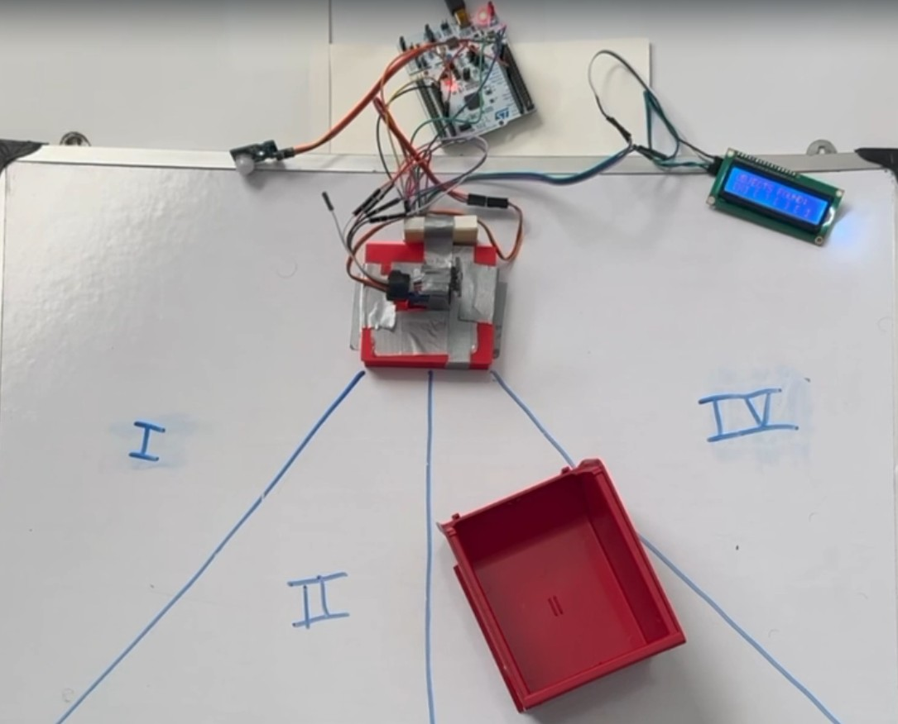
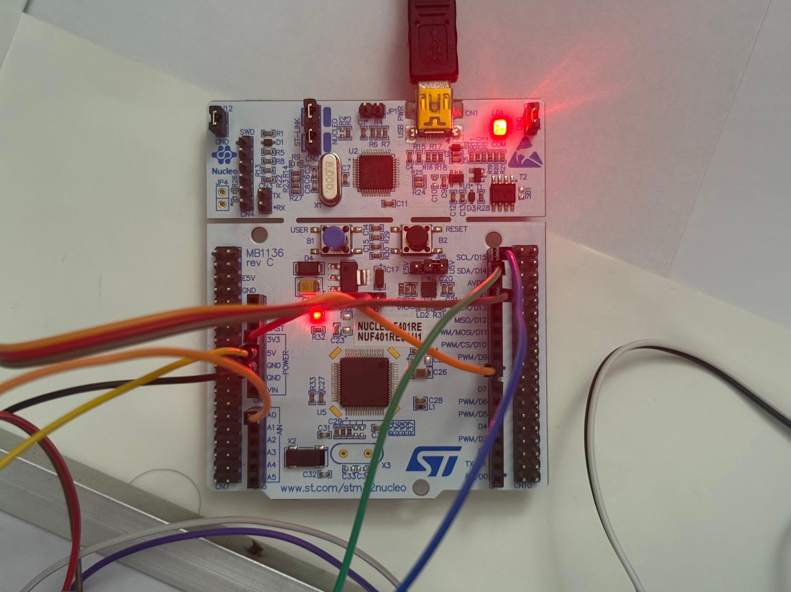
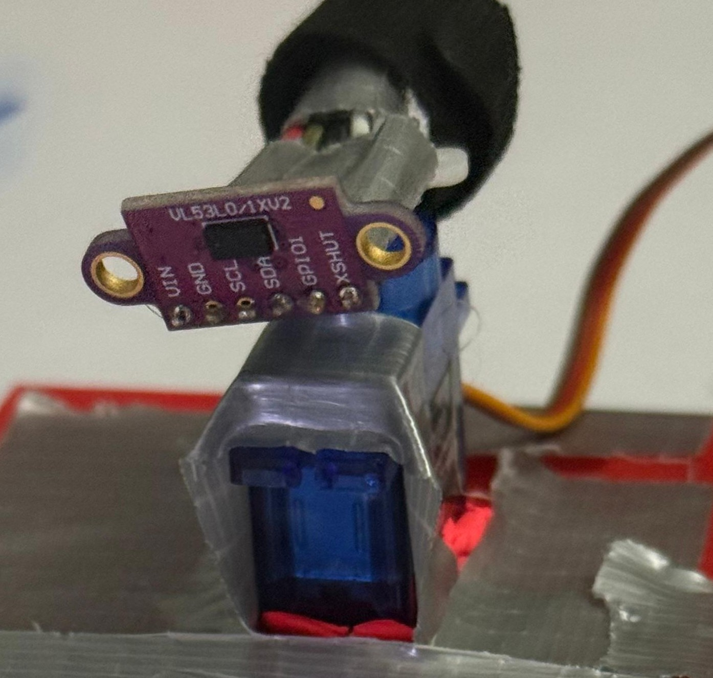
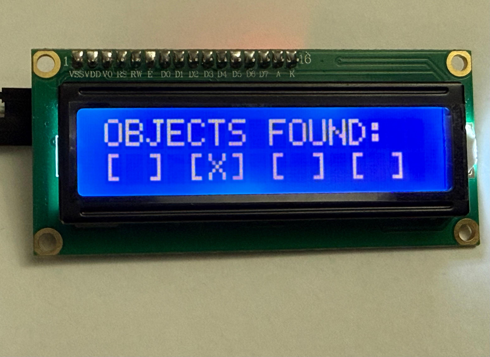
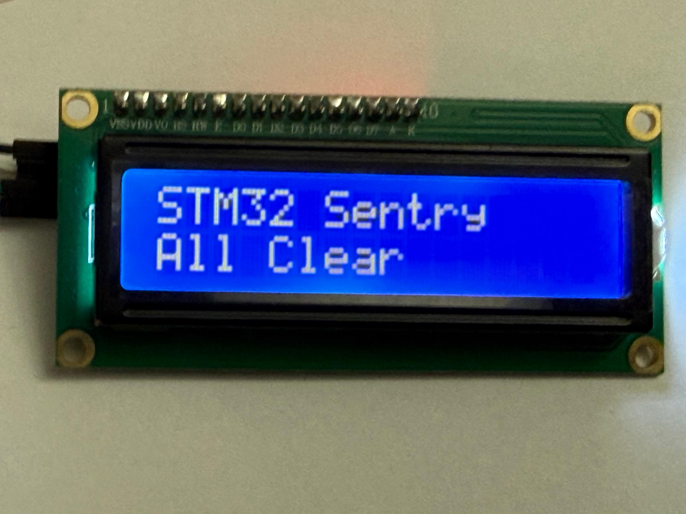

# STM32 Security Sentry

<!-- > **A non-blocking embedded security system built on the STM32F401RE NUCLEO platform. It integrates Time-of-Flight (ToF) ranging, PIR motion detection, and mechanical actuation into a Finite State Machine (FSM).** -->

 

## System Demo

*[Click here to watch the full demo video](LINK_TO_VIDEO)*

## Overview
This project is a stationary sentry system built on the **STM32F401RE NUCLEO** platform to monitor and protect four physical sectors. The system integrates **PIR** motion detection, **Time-of-Flight (ToF) LiDAR** ranging, and mechanical actuation within a clean Finite State Machine (**FSM**). Unlike simple looping Arduino-style designs, it uses a bare-metal **HAL-based** approach without an RTOS, relying on **hardware interrupts (EXTI)** for event-driven responsiveness and non-blocking timers for **real-time scanning**, control, and state transitions.

The system mimics a radar station:
1.  **Sleeps** until motion is detected (PIR).
2.  **Wakes** and performs a mechanical sweep of the area (Servo + LiDAR).
3.  **Maps** intrusions into specific sectors.
4.  **Notifies** the user and enters a "Protect Mode" loop with active scanning if the threat persists.


## Hardware Architecture

| Component | Role | Interface | Protocol |
| :--- | :--- | :--- | :--- |
| **STM32F401RE NUCLEO** | Primary Controller | - | - |
| **VL53L0X LiDAR** | Precision Ranging (The "Verifier") | I2C1 | I2C |
| **HC-SR501 PIR** | Motion Trigger (The "Wake-up") | PA9 | EXTI (Interrupt) |
| **SG90 Servo** | Pan Mechanism (The "Actuator") | TIM2 CH1 | PWM |
| **16x2 LCD** | User Interface | I2C1 | I2C |

### Hardware Setup
<p float="left">
  
   
</p>

## Software Architecture: Finite State Machine
The core logic replaces standard blocking delays with a 3-Stage Finite State Machine. This allows the CPU to process sensor data and update the display simultaneously while managing mechanical movement physics.

### 1. IDLE (Low Power / Monitor)
* **Behavior:** The system is static. The servo is parked at 0°. The CPU waits for an external interrupt from the PIR sensor.
* **Logic:** `motionDetected` flag is set via `HAL_GPIO_EXTI_Callback`.
* **Transition:** Motion $\rightarrow$ **SCAN**.

### 2. SCAN (Active Mapping)
* **Behavior:** The servo sweeps 0° to 180° in 10° increments.
* **Physics Handling:** The system reads the LiDAR data from the *stable* current position before moving the servo to the next angle, preventing "blurry" sensor data caused by motor vibration.
* **Data Processing:** Distance data (< 500mm) is mapped into one of 4 angular sectors (45° slices).
* **Transition:** Sweep Complete (180°) $\rightarrow$ **NOTIFY**.

### 3. NOTIFY (Decision & Feedback)
* **Behavior:** The system analyzes the sector map.
* **Intruder Logic:**
    * **If Objects Found:** The LCD maps the threat location (e.g., `[X] [ ] [ ] [X]`). The system resets the servo and immediately re-enters **SCAN** (Protect Mode) to actively verify if the threat persists.
    * **If Clear:** The LCD displays "All Clear". A **Smart Wait** loop monitors the PIR sensor for 1 second. If motion occurs *during* the message, the delay is aborted immediately to re-arm the system.


### Display Logic:
| Objects Detected | All Clear |
| :---: | :---: |
|  |  |


## Wiring & Pinout

| STM32 Pin | Component Pin | Description |
| :--- | :--- | :--- |
| **PA0** | Servo Signal | TIM2 Channel 1 (PWM Generation) |
| **PB8** | LCD/LiDAR SCL | I2C1 Clock |
| **PB9** | LCD/LiDAR SDA | I2C1 Data |
| **PA9** | PIR Signal | EXTI Line 9 (Rising Edge Interrupt) |
| **5V** | VCC | Power for Servo & LCD |
| **3.3V** | VCC | Power for LiDAR & PIR |
| **GND** | GND | Common Ground |

## Key Engineering Challenges Solved

### 1. Whip Pan Bug
**Problem:** Resetting the servo from 180° to 0° takes physical time (~400ms). The code runs in microseconds. This caused the system to start the next scan while the motor was still flying back to the start, resulting in "ghost" detections on the left side of the room.
**Solution:** Implemented a non-blocking mechanical settle delay only during the reset phase, ensuring the motor is physically stable before the LiDAR begins ranging.

### 2. Blind Spot Security
**Problem:** Using `HAL_Delay(1000)` to display an "All Clear" message froze the CPU, leaving the system blind to intruders for 1 full second.
**Solution:** Replaced blocking delays with a `while` loop that checks `HAL_GetTick()` but breaks immediately if the `motionDetected` interrupt flag is raised. This prevents the system from missing a detection

## Build Instructions

1.  **Clone the Repo:**
    ```bash
    git clone https://github.com/TechNotebookYT/stm32_sentry.git
    ```
2.  **Open in STM32CubeIDE:**
    * File > Open Projects from File System.
3.  **Drivers:**
    * Ensure `VL53L0X` drivers and `i2c_lcd` drivers are in `Core/Src` and `Core/Inc`.
4.  **Compile & Flash:**
    * Build Project (Hammer Icon).
    * Run > Debug As > STM32 Cortex-M C/C++ Application.

## Future Improvements
* **UART Logging:** Outputting precise distance maps to a Python script for a real-time radar GUI.
* **Buzzer Integration:** Adding an audible alarm during the `NOTIFY` state if proximity is < 20cm.
* **Wireless:** Integration with ESP8266/ESP32 via UART to send alerts to a mobile device.

---
*Built with STM32CubeIDE*